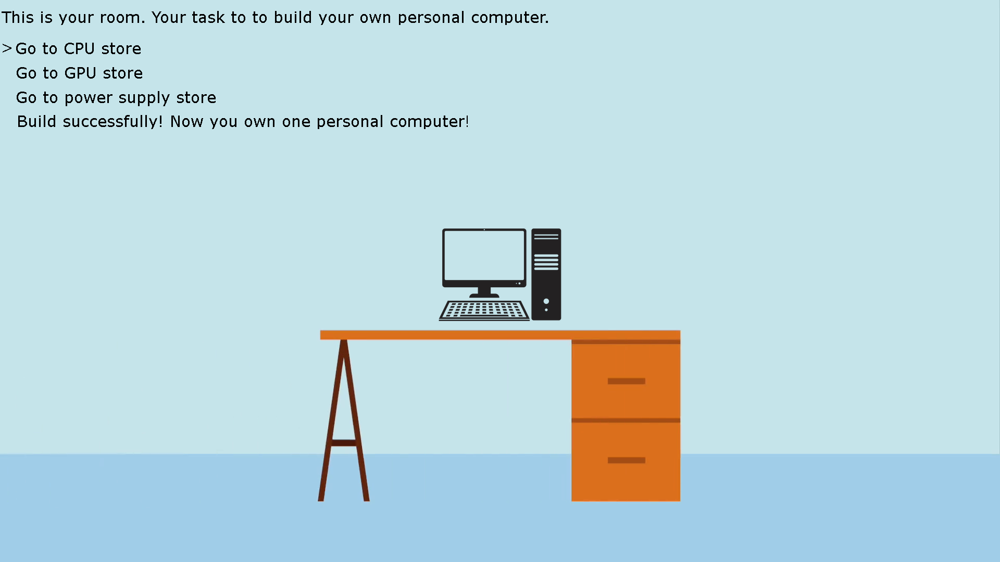

# (BORING COMPUTER)

Author: Jiechen Li, jiechenl

Design: (TODO: In two sentences or fewer, describe what is new and interesting about your game.)

You want to build your own personal computer. Now you already have some necessary accessories. You need to go to stores and buy CPU, GPU and power supply.

Screen Shot:

How To Play:

Use Up and Down to make your choice and use Enter to confirm your choice.
When you have bought necessary hardwares, you can build your personal computer!
The biggest difference between game2 and game1 is the sound. In game2, you can still buy CPU, GPU and power supply. 
When you buy hardwares, if you already have them, you will hear a sound which represents this operation is failed.
If you don't have them, you will hear another sound which represents this operation is succeed.
But power supply is not always sold by the store. It means if you don't have power supply, you can still hear the failed sound if you are unlucky.
And the power supply picture will not show in your desk! So you have to listen the sound to check if your operation is succeed.
Based on the sound, you will know if power supply is available. When you get all three hardwares, you can build your own computer!
(This game is kind of boring...)

Sources:

(TODO: fill in information about the sources of any **artwork** or **sounds** you used in the game that you did not create yourself. Feel free to also credit yourself for things you did make.)
I've read your feedback for my game1 and I checked licenses of these sources.

Art Sources:

2 and 5 can used freely if I credit them.
1, 3, 4 are for sale. So I bought them.
For 6, I found "the images displayed on this site may be used for Free or educational purposes only".

1 https://jp.123rf.com/photo_86740837_%E6%BC%AB%E7%94%BB%E3%81%AE%E3%82%B7%E3%83%A7%E3%83%83%E3%83%94%E3%83%B3%E3%82%B0-%E3%82%BB%E3%83%B3%E3%82%BF%E3%83%BC%E3%81%AE%E5%BB%BA%E7%89%A9%E3%82%84%E5%A4%A7%E3%81%8D%E3%81%AA%E7%AA%93%E3%81%A8%E7%8F%BE%E4%BB%A3%E7%9A%84%E3%81%AA%E5%BB%BA%E7%AF%89%E6%A7%98%E5%BC%8F%E3%81%A7%E5%BB%BA%E3%81%A6%E3%82%89%E3%82%8C%E3%81%9F%E7%9C%8B%E6%9D%BF%E3%83%A2%E3%83%BC%E3%83%AB%E3%81%97%E3%81%BE%E3%81%99%E3%80%82%E3%83%87%E3%83%91%E3%83%BC%E3%83%88%E3%82%84%E5%BA%97%E3%81%AE%E5%A4%96%E8%A6%B3%E3%80%82%E3%83%A2%E3%83%80%E3%83%B3%E3%81%AA%E9%83%BD%E5%B8%82%E3%83%87%E3%82%B6%E3%82%A4%E3%83%B3%E3%80%82.html
2 https://br.vexels.com/png-svg/previsualizar/157318/computador-de-icone-de-computador-desktop
3 https://www.iconfinder.com/icons/548957/computer_equipment_fan_hardware_pc_power_supply_icon
4 https://www.iconfinder.com/icons/193668/cpu_hardware_microprocessor_processor_icon
5 https://github.com/FortAwesome/Font-Awesome/issues/12990
6 https://menduk.org/?img=https%3A%2F%2Fd2v9y0dukr6mq2.cloudfront.net%2Fvideo%2Fthumbnail%2FQIAQ9Rd%2Fvideoblocks-cartoon-woman-workspace-office-desk-drawers-cactus-and-calendar-speech-bubble-animation-hd_s0yqrlk3f_thumbnail-full01.png

7 https://www.pngfly.com/png-xiwd0v/download.html
8 http://wallpaperesque.com/image/1405
Sounds Sources:
1 https://freesound.org/people/YellowTree/sounds/483907/
2 https://freesound.org/people/nowism/sounds/484477/
3 https://freesound.org/people/JohanDeecke/sounds/367768/

This game was built with [NEST](NEST.md).
